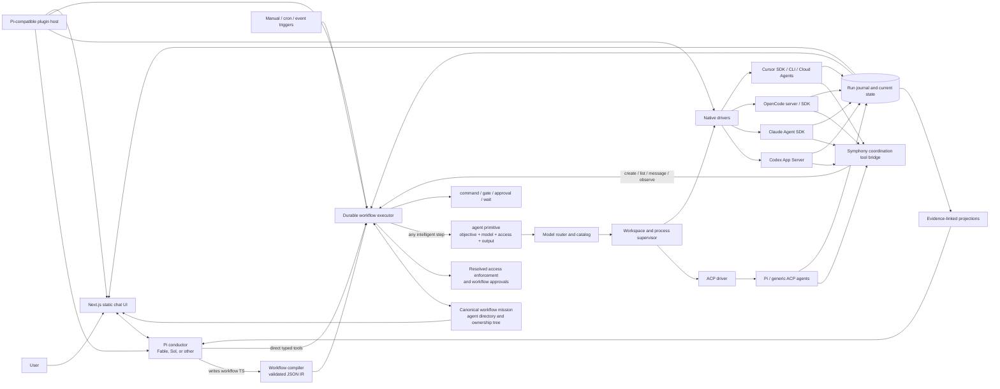

# Symphony: architecture and build plan

**Status:** original research plan; implementation details are superseded by [`architecture.md`](./architecture.md) and the source tree

**Date:** 30 August 2026

**Audience:** product owner and initial implementers
**Scope:** a local-first, single-user orchestration harness that lets one conversational conductor author durable workflows, delegate every kind of intelligent work through one agent-run primitive, observe workers without interrupting them, and steer or repeat the workflow deliberately.

## Executive answer

This is feasible now, and the right product is not another chat multiplexer. It is an open-source local orchestration kernel with six distinct layers:

1. **Pi as the conductor harness.** The user talks to one strong model—Claude Fable 5, GPT-5.6 Sol, or another provider selected in config—through Pi's embedded TypeScript SDK. Pi already provides the agent loop, tools, multi-provider routing, persistent sessions, steering, compaction, and programmatic control.
2. **A workflow charter, compiler, agent graph, and durable executor.** Each workflow has one short canonical mission inherited unchanged by every descendant, plus a user-configurable maximum agent depth. The conductor can write TypeScript workflow files containing triggers, sequences, fan-out, typed conditions, while loops, and explicit checkpoints. Symphony compiles them into an immutable execution graph.
3. **One intelligent-work primitive: `agent()`.** There is no role field and no implementer/reviewer/researcher taxonomy. The objective says what the agent must do. Every invocation has a model/harness selector, binary access, typed inputs, and a required output schema. Deterministic operations such as tests remain `command()` or `gate()` steps because an exit code should not be decided by a model.
4. **ACP plus selective native adapters behind `agent()`.** ACP gives Symphony one common local protocol for Claude, Codex, Cursor, OpenCode, and Pi. Richer native integrations remain implementation details where they materially improve control: Codex App Server, Claude Agent SDK, Cursor's TypeScript SDK and Cloud Agents API, and OpenCode's server/SDK.
5. **A Pi-compatible plugin plane.** Trusted local packages can extend conductor tools, drivers, catalog sources, workflow steps, triggers, and bounded UI slots. Agents may edit a checked-out plugin project and see a validated, atomic hot reload without restarting the daemon or active workers.
6. **A minimal durable run journal plus read-only projections.** Symphony persists only graph metadata, semantic workflow state, costs, messages, and the evidence needed for recovery and non-interrupting observation. It does not become a transcript warehouse, repository memory system, or vector database.

This preserves the reason native harnesses are valuable: Codex remains Codex, Claude Code remains Claude Code, Cursor remains Cursor, and OpenCode remains OpenCode. Symphony coordinates their sessions; it does not rebuild their inner loops. The public protocols, schemas, fixtures, and plugin SDK are part of the product surface rather than private internals.

There is one immediate naming issue. OpenAI now publishes an official open-source project named [Symphony](https://github.com/openai/symphony) for issue-driven Codex orchestration. It is explicitly a narrower reference implementation, but the overlap is close enough to create search, package, and conceptual confusion. Keep **Symphony** as a private working title if desired, but choose a public name only after package, domain, repository, and trademark checks.

I am also treating the spoken “Py” as **[Pi Agent Harness](https://pi.dev/)**. That identification is highly likely from the role described, but it is still an inference.

## Product thesis

The primary interface is a conversation with a **conductor**, not a grid of agent chats. The conductor can author and revise reusable workflows, or directly invoke the same underlying primitives. It is given tools to:

- decompose work into explicit work orders;
- request an agent while the neutral router selects its model and harness unless explicitly overridden;
- create child agents;
- list every agent in the current workflow with its objective, parent, depth, and state;
- observe any agent at `tldr`, `paragraph`, or `full` granularity without interrupting it;
- retrieve exact events, artifacts, diffs, or test results when needed;
- queue a steering message at a safe boundary;
- create another agent whose objective is independent review;
- cancel or replace a worker;
- create, validate, explain, and run workflow revisions;
- register a workflow trigger after explicit approval;
- report one coherent result to the user.

Workers are treated like competent colleagues: they receive a clear outcome, boundaries, and definition of done; they are not continuously micromanaged. The conductor asks for more detail only when a summary is stale, contradictory, low-confidence, or indicates drift.

### V1 non-goals

- Replacing the native coding harnesses with a generic raw-model loop.
- Running two writers in the same working tree.
- Building a distributed, multi-tenant cloud scheduler.
- Executing arbitrary model-written TypeScript without compilation, validation, and policy checks.
- Inferring success from a conversational summary.
- Parsing terminal screen contents or undocumented session files as a primary API.
- Giving an observer or reviewer authority to approve destructive or external actions.
- Supporting every harness at full fidelity on day one.
- Building repository RAG, a vector database, a long-term memory product, or a duplicate transcript store.
- Patching or replacing the native agent loops inside Codex, Claude Code, Cursor, OpenCode, or Pi.

## Architecture



The important separation is between **judgment** and **authority**, not between implementers and reviewers. The Pi conductor decides what it wants to do and can express it as a workflow. The executor validates the compiled graph and every step against state, capabilities, resolved access, and workspace ownership before anything happens.

## Why Pi should be the conductor

Pi is unusually well matched to the conductor role:

- Its [TypeScript SDK](https://pi.dev/docs/latest/sdk) can be embedded instead of scraped through a terminal.
- Its [RPC mode](https://pi.dev/docs/latest/rpc) exposes JSONL commands, events, prompt, steer, follow-up, abort, state, model selection, compaction, and session operations.
- Pi sessions are persistent append-only trees. `get_entries({ since })` uses stable entry IDs as durable cursors across restarts and includes pre-compaction history and abandoned branches. This is exactly the primitive a passive observer needs.
- Pi is multi-provider, so the conductor can use Fable, Sol, or a cheaper model without rewriting the orchestration layer.

Use the embedded SDK for the conductor because it needs tight integration with Symphony's tools and UI. Run Pi as a subprocess when it acts as an ordinary worker, because process isolation is then more valuable than in-process introspection.

Pi does not provide a complete security boundary by itself. Symphony must still own worktree isolation, child-process permissions, credentials, network grants, and policy.

## Worker integration strategy

### Use ACP as the common floor

The [Agent Client Protocol](https://agentclientprotocol.com/get-started/architecture) was designed for an editor or client to launch coding-agent subprocesses, exchange JSON-RPC over stdio, run multiple sessions, stream updates, and handle permission requests. Its current [registry](https://agentclientprotocol.com/get-started/registry) lists Claude Agent, Codex, Cursor, OpenCode, and Pi ACP.

That makes ACP the fastest route to broad compatibility. Symphony should implement one version-pinned ACP driver that covers:

- initialize and capability discovery;
- authentication methods;
- new, list, resume, and close session where advertised;
- prompts and streamed `session/update` events;
- tool and filesystem permission requests;
- cancellation;
- session config such as models and modes.

ACP must not become a lowest-common-denominator prison. Each driver advertises a capability object, and the conductor chooses behavior based on those capabilities. A native extension can expose richer features such as safe-boundary steering, detached review, replay cursors, diffs, or usage details.

### Preferred adapter per harness

| Harness | Preferred v1 integration | What it gives Symphony | Important limitation |
|---|---|---|---|
| **Pi conductor** | Embedded Pi SDK | Multi-provider conversational loop, tools, sessions, compaction, direct subscriptions | In-process; keep worker execution outside it |
| **Pi worker** | Pi RPC or Pi ACP | Structured events, steer/follow-up, abort, durable `get_entries` cursor | Symphony must impose the sandbox |
| **Codex** | [Codex App Server](https://learn.chatgpt.com/docs/app-server) over stdio | Threads, resume/fork/read/list, turn steer/interrupt, approvals, structured item events, detached review | WebSocket mode is experimental; use stdio or local Unix socket |
| **Claude Code** | [Claude Agent SDK](https://code.claude.com/docs/en/agent-sdk/overview) | Native Claude Code subprocess, structured iterator, session resume/fork, approvals, hooks, usage and cost | Symphony must own the live iterator; do not parse internal JSONL files |
| **Claude background** | `claude --bg` fallback | Detached process, JSON roster, status and logs, built-in cheap summaries | Research preview; not the primary integration contract |
| **OpenCode** | [OpenCode server/SDK](https://opencode.ai/docs/server/) | Long-lived HTTP service, sessions, messages, diffs, fork, abort, summarize, async prompt, SSE | Persist Symphony's semantic run journal; public event stream lacks a documented durable cursor |
| **Cursor local** | [Cursor TypeScript SDK](https://prod.cursor.com/docs/sdk/typescript), then Cursor CLI fallback | Native local agent, streamed messages and usage, model/tool controls, create and resume; CLI preserves a user's independent Cursor login | Local SDK execution is powerful by default; Symphony must map `read-only` through tool restrictions, hooks, and sandboxing rather than trust a prompt |
| **Cursor Cloud** | [Cursor TypeScript SDK](https://prod.cursor.com/docs/sdk/typescript) over the [Cloud Agents API](https://prod.cursor.com/docs/cloud-agent/api/endpoints) | Durable remote agents and prompt runs, follow-ups, conversation, artifacts, usage, list/get/archive, and resume | Cloud starts from a remote repository/ref, not a dirty local worktree; API v1 has no webhook, so stream or poll with a durable cursor |
| **Cursor ACP** | [Cursor ACP](https://prod.cursor.com/docs/cli/acp) compatibility floor | Native modes, streamed updates, permissions, questions/plans, cancel, session load | No documented passive incremental transcript cursor; Symphony must tee every update |
| **Other ACP agent** | Generic ACP driver | Fast breadth with native runtime/auth/config | Capability quality varies; conformance-test and pin versions |

PTYs are an optional human attachment surface. They are not a control protocol.

### Cursor is a first-class local and cloud harness

Do not force Cursor through ACP when its native SDK exposes a better contract. Implement one `driver-cursor-sdk` around `@cursor/sdk` and allow the same `agent()` work order to resolve to either `local: { cwd }` or `cloud: { repos, autoCreatePR }`. Record both the Cursor agent ID and the individual run ID beneath Symphony's logical agent attempt; normalize stream events into the run journal; retain Cursor's usage event as provider evidence; and use `Agent.resume(id)` or the Cloud Agents run APIs during reconciliation.

Cloud selection must be honest about source state. A Cursor Cloud agent runs in an isolated remote environment from a connected source-control repository and starting ref. Before routing a work order to cloud, the compiler verifies that every required input is reachable from that ref or is an explicit uploaded artifact. If the task depends on uncommitted local files, Symphony either chooses a local harness or asks the user to create an explicit checkpoint; it never silently sends a stale branch.

Support two authentication paths without ever brokering a user's account password:

- a Cursor API key created for a user or service account, stored in the OS keychain or supplied as `CURSOR_API_KEY` to the daemon; and
- an independently authenticated `cursor-agent` CLI session as a local fallback when the user prefers Cursor's native login.

API keys, OAuth material, and native session tokens never enter workflow files, plugin manifests, SQLite events, logs, or the browser bootstrap. The UI can accept a key once and hand it directly to the local secret store. Non-secret choices such as local versus cloud, repository allowlists, polling cadence, and default PR behavior belong in configuration.

Cursor Cloud's agent status and each prompt run's status are different state machines. Symphony should preserve that distinction, support follow-up runs on an idle durable agent, and use bounded polling with backoff until Cursor adds a webhook contract. The [Cursor SDK Bridge](https://github.com/cursor/sdk-bridge) is a useful conformance fixture for the stable `sdk.v1` semantics, not another runtime that Symphony needs to embed.

### Do not put MCP in the wrong layer

Use **MCP** to supply tools and context to the conductor or workers. Do not use it as the worker-session supervisor. ACP models the client-to-agent lifecycle; MCP models tool/data access. Reserve **A2A** for a future boundary to remote, independently hosted agents. Export traces through **OpenTelemetry**, but keep Symphony's semantic run journal as the canonical audit and recovery record.

### Keep the harnesses vanilla and Symphony thin

Symphony sits between native harnesses; it does not reach inside and redesign them. Each native harness continues to own its model loop, context management, built-in tools, authentication, transcript, compaction, and provider-specific behavior. A driver should do only five things: launch or resume a session, translate lifecycle events, inject the small coordination tool surface, deliver messages or cancellation through supported APIs, and report usage when available.

Symphony owns only what no individual harness can own: workflow mission and revision, parent-child graph, agent directory, cross-harness messages, compiled workflow state, semantic activity events, observations, and cost aggregation. Do not build repository ingestion, chunking, embeddings over source code, a vector database, a generalized memory service, or a shadow copy of every native transcript.

The model directory is the sole narrow use of semantic retrieval. It contains hundreds rather than millions of small candidate records, so embeddings can be recomputed into an in-memory flat index during catalog refresh and discarded on shutdown. Agent observation reads chronological events and explicit file/artifact references directly; it is not RAG.

## Core runtime contracts

### Workflow files: TypeScript authoring, JSON execution

The conductor should be allowed to write `.symphony/workflows/*.workflow.ts`, but the scheduler should never execute that TypeScript directly. A restricted TypeScript DSL gives the conductor good composition and type checking; a compiler then emits a pure, versioned JSON intermediate representation (IR). The compiler rejects unknown capabilities, ambiguous references, schema-invalid conditions, unsafe workspace combinations, and triggers that exceed policy. A while loop may intentionally be open-ended; the run remains manually cancellable and every iteration is durably recorded.

### Canonical workflow mission and objective discipline

Every workflow revision contains a short charter owned by the workflow, not by whichever agent happens to spawn the next child:

```ts
type WorkflowMission = {
  statement: string
  keyResults?: string[]
}

type AgentInput = AgentOutputRef | ArtifactRef | FileRef | SkillRef
```

The mission should normally be one to three sentences, with only a few concrete key results. Symphony injects the exact same mission revision into the conductor and every descendant alongside that agent's local objective. A parent supplies the child's objective and inputs, but cannot paraphrase, replace, or omit the workflow mission. Dynamic workflow patches cannot alter it; changing the mission creates a new workflow revision.

Ad-hoc work from the conductor chat is still wrapped in a workflow run. Before the first child is created, the conductor writes one short mission derived from the user's request and Symphony freezes it for that run. The user can see and edit it at the top of the command center; once execution begins, an edit forks a new revision rather than silently changing context under active agents.

Objectives should also stay small: a direct goal plus any essential process, usually one or two sentences. Long procedures, coding conventions, examples, and domain knowledge belong in versioned skill or instruction files referenced through `inputs`. This keeps the agent directory legible and prevents prompt content from drifting as it passes down the tree. Symphony does not concatenate every ancestor's prompt into a child; each launch receives only the canonical mission, its own objective, and its explicit input references.

The initial context presented through each native harness is conceptually:

```text
Workflow mission: <exact immutable mission statement>
Key results: <exact optional list>
Your objective: <short child-specific objective>
Inputs: <agent outputs, artifacts, files, and skills by reference>
```

Use the native harness's ordinary prompt and supported instruction/skill mechanisms. Do not patch its internal prompt builder or replace its agent loop.

```ts
const ReviewResult = schema.object({
  score: schema.integer({ minimum: 0, maximum: 10 }),
  feedback: schema.array(schema.string()),
})

export default workflow({
  id: 'build-review-loop',
  mission: {
    statement: 'Ship the requested feature as a coherent, reliable part of the product.',
    keyResults: ['Tests pass', 'Independent review scores at least 8/10'],
  },
  maxAgentDepth: 3,
  triggers: [manual(), cron('0 9 * * 1-5')],
  steps: [
    whileLoop('quality-loop', {
      while: expr('review.output == null || review.output.score < 8'),
      do: [
        agent('build', {
          objective: 'Build or improve the feature until it clears review.',
          model: 'auto',
          harness: 'auto',
          routing: { taskKind: 'coding', prioritize: ['coding-success', 'fewest-turns'] },
          inputs: optionalRefs('review.output'),
          output: FeatureResult,
        }),
        command('test', { run: 'pnpm test' }),
        agent('review', {
          objective: 'Judge the finished feature against the requested outcome.',
          model: 'auto',
          harness: 'auto',
          routing: { taskKind: 'frontend', prioritize: ['human-preference'] },
          permissions: 'read-only',
          inputs: refs('build.output', 'test.output'),
          output: ReviewResult,
        }),
      ],
    }),
  ],
})
```

The v1 step vocabulary should stay small: `agent`, `command`, `gate`, `approval`, `wait`, `sequence`, `parallel`, `branch`, and `while`. Triggers are `manual`, `cron`, and later repository/webhook events. An `agent()` may propose a typed `WorkflowPatch` at runtime—for example, adding two targeted review branches—but the executor validates and records that patch before scheduling it.

The output schema is the workflow's control surface. Symphony validates the agent's final value against the schema before committing the step. Conditions can reference only committed typed outputs, so `review.output == null || review.output.score < 8` is a real engine predicate rather than a model interpreting prose. A schema failure fails the step or invokes an explicitly declared repair path; it never silently supplies a value to the loop.

Workflow revisions are immutable once a run starts. Each run records the source hash, compiled IR hash, routing snapshot, config revision, and trigger occurrence. Saving a local workflow file is reversible; enabling a recurring trigger creates future autonomous execution and therefore requires an explicit user approval or an already-authorized policy. Schedules and other non-secret settings live in config files. Only API keys and credentials live in environment variables, native credential stores, or the OS keychain.

### The one agent-run primitive

The public runtime contract is one call for every kind of intelligent work:

```ts
type AgentStep = {
  objective: string
  model: 'auto' | ModelId
  harness: 'auto' | 'codex' | 'claude' | 'cursor' | 'opencode' | 'pi'
  workspace: WorkspaceGrant
  permissions?: 'read-only' | 'full-access' // defaults to full-access
  routing?: RoutingIntent
  inputs: AgentInput[]
  output: JsonSchema
  resume?: AgentRunRef
}
```

There are only two resolved access modes. `full-access` is the root default and automatically approves every capability available to the launched harness and Symphony process. `read-only` is an explicit narrowing that denies workspace mutation and side-effecting tools. There are no per-tool permission knobs. Child agents inherit their parent's resolved access by default, and a `read-only` parent cannot create a `full-access` child. An explicit `approval()` workflow step may still be used as a human checkpoint, but it is control flow rather than a third permission mode. The UI and run journal always display the resolved access mode.

“Independent review” means another `agent()` invocation whose objective is to review the work and whose permissions are explicitly `read-only`. No roleplay or special reviewer type is involved. “Native harness” is likewise not a public primitive: it is the driver selected behind `agent()` so an OpenAI model can run in Codex and an Anthropic model can run in Claude Code while Symphony presents one contract.

The executor still needs non-agent primitives. Tests, linters, builds, timers, approvals, and conditions have objective machine states; wrapping them in agents would make workflows slower, more expensive, and less reliable.

### Work order

Every delegation starts as a typed work order. This is what prevents vague prompts from turning into unbounded parallel activity.

```ts
type WorkOrder = {
  id: string
  objective: string
  repository: { root: string; baseRef: string }
  permissions?: 'read-only' | 'full-access'
  constraints: string[]
  definitionOfDone: string[]
  model: 'auto' | ModelId
  harness: 'auto' | 'codex' | 'claude' | 'cursor' | 'opencode' | 'pi'
  routing?: RoutingIntent
  outputSchema: JsonSchema
}
```

### Driver contract

```ts
interface WorkerDriver {
  discover(): Promise<DriverCapabilities>
  launch(input: LaunchInput): Promise<WorkerHandle>
  newSession(input: SessionInput): Promise<SessionHandle>
  resumeSession(input: ResumeInput): Promise<SessionHandle>
  sendTurn(session: SessionHandle, prompt: Prompt): Promise<TurnHandle>
  subscribe(session: SessionHandle): AsyncIterable<NativeEvent>
  readSince?(session: SessionHandle, cursor?: string): Promise<EventPage>
  inspect(session: SessionHandle): Promise<NativeSnapshot>
  steer?(turn: TurnHandle, prompt: Prompt): Promise<void>
  followUp?(session: SessionHandle, prompt: Prompt): Promise<void>
  respondToPermission(requestId: string, decision: PermissionDecision): Promise<void>
  cancelTurn(turn: TurnHandle): Promise<void>
  closeSession(session: SessionHandle): Promise<void>
}
```

`DriverCapabilities` must say what is actually supported: passive read, replay cursor, live steer, queued follow-up, resume, fork, detached review, usage, diff, approvals, filesystem mediation, and cancellation confirmation.

### Lifecycle

```text
planned → queued → starting → running
                              ├→ waiting_input
                              ├→ waiting_approval
                              └→ cancellation_requested

terminal: accepted | completed | failed | cancelled | rejected | lost
```

Keep native state and stop reason beside the normalized state. `cancellation_requested` is not `cancelled`; the supervisor must observe a terminal confirmation or process exit.

## Observation without interruption

The central design is an event **tee**:

```text
native harness → adapter → normalized semantic event
                              ├→ run-state projection
                              ├→ UI activity stream
                              ├→ optional telemetry exporter
                              └→ redactor → observer model → summary projection
```

The observer process:

- has read-only access to committed event ranges and selected workspace evidence;
- has no worker stdin, session-control method, credential, approval authority, or command-delivery tool;
- receives the previous digest plus new events for incremental refreshes, and may retrieve the full committed history or selected older ranges when `full` granularity or a contradiction requires it;
- emits structured output with source event IDs and artifact hashes;
- cannot mark a run complete, approve an operation, or declare a test passed.

An observer digest should contain:

```ts
type ObserverDigest = {
  objective: string
  currentState: string
  completedWork: EvidenceClaim[]
  filesChanged: string[]
  commandsAndTests: EvidenceClaim[]
  decisions: EvidenceClaim[]
  blockers: EvidenceClaim[]
  risks: EvidenceClaim[]
  openQuestions: EvidenceClaim[]
  expectedNextCheckpoint?: string
  freshness: { throughSeq: number; observedAt: string }
  contradictions: string[]
  confidence: number
  summarizer: { provider: string; model: string; promptHash: string }
}
```

Each `EvidenceClaim` includes one or more event IDs or artifact IDs. If the observer cannot support a claim, it omits it or marks it uncertain.

### When to summarize

Generate a digest at semantic checkpoints, not per token:

- a tool or command completes;
- files or diff statistics change materially;
- tests finish;
- the agent asks for input or approval;
- a turn completes or fails;
- a time/token threshold is crossed on a long turn;
- the conductor explicitly asks for a fresh digest.

Coalesce text deltas before summarizing them. Leave full transcripts and raw token streams in the native harness. Store only semantic events, delivery receipts, state transitions, usage, evidence references, and bounded artifacts required for recovery or user inspection; do not send raw secrets or entire terminal dumps to the observer.

### Tools exposed to agents

Every Symphony agent, including the conductor, receives a workflow-scoped directory and coordination tools:

- `create_agent({ objective, model, harness, permissions?, routing?, inputs, output })`
- `list_agents({ scope?: 'workflow' | 'children' | 'descendants', state?: AgentState[] })`
- `send_message({ agentId, message })`
- `observe_agent({ agentId, granularity: 'tldr' | 'paragraph' | 'full' })`

```ts
type AgentDirectoryEntry = {
  agentId: string
  parentAgentId?: string
  depth: number
  objective: string
  state: AgentState
  model: string
  harness: string
  access: 'read-only' | 'full-access'
  childCount: number
  lastActivityAt: string
}
```

Keep the graph concepts precise. The compiled workflow is a directed execution graph. Agent ownership is a rooted tree with the conductor at the top and exactly one parent per child. Messages and observations form optional cross-tree edges. The UI may overlay all three, but recovery and depth enforcement use the stable ownership tree rather than trying to infer hierarchy from who talked to whom.

`list_agents` defaults to the whole current workflow, so every agent can discover every peer and see the shared ownership tree without receiving every transcript. Filtering to active states answers “who is working right now?” Objectives are returned in full but are intentionally short enough to scan. Cross-workflow discovery is not exposed to ordinary agents.

The conductor is depth zero. The user sets `maxAgentDepth` in the workflow or project config. When an agent is launched at that depth, Symphony omits `create_agent` from its tool manifest entirely; `list_agents`, `send_message`, and `observe_agent` remain available. This makes the recursion boundary visible to the model instead of giving it a tool that will always fail.

`create_agent` returns an agent ID immediately and follows the access-inheritance rule: omitted permissions inherit the caller; a root caller with no explicit mode gets `full-access`; `read-only` can never create `full-access`. `send_message` can target any agent in the same workflow, uses the richest native safe-delivery operation available—live steer at a message boundary when supported, otherwise a queued follow-up—and returns a delivery receipt rather than pretending the target consumed it.

`observe_agent` never messages, resumes, or interrupts the target. It reads the committed run journal, passive native history where supported, workspace evidence, and the previous cached observation, then invokes a cheap large-context model through the normal neutral router. GLM 5.3 Flash is a plausible candidate, but the observer query should request low cost, large context, reliable summarization, and schema support rather than hard-code a vendor.

The three observation levels are stable output contracts:

```ts
type ObservationGranularity = 'tldr' | 'paragraph' | 'full'

type AgentObservation = {
  agentId: string
  state: AgentState
  throughEvent: number
  observedAt: string
  summary: string
  evidence: EvidenceRef[]
  details?: {
    completed: EvidenceClaim[]
    currentWork: EvidenceClaim[]
    changedFiles: string[]
    commandsAndTests: EvidenceClaim[]
    decisions: EvidenceClaim[]
    blockers: EvidenceClaim[]
    nextLikelyStep?: EvidenceClaim
    cost: CostSummary
  }
}
```

- `tldr`: exactly one sentence containing state, current action, and blocker if one exists.
- `paragraph`: one compact paragraph covering progress, current work, next step, and blockers.
- `full`: the structured breakdown above, with event/artifact references and cost.

Cache observations by `(agentId, throughEvent, granularity, observerModel)`. If no new event has committed, return the cached result without paying for another model call. Administrative utilities—`list_agents`, `wait_for_agents`, `cancel_agent`, `get_agent_evidence`, and `get_cost`—are also available to the conductor and workflow runtime, but they are not extra ways for agents to converse.

Deliver the coordination tools through a Symphony-owned MCP server or the harness's equivalent native tool bridge. Each launched worker receives a short-lived capability bound to its Symphony agent ID and workflow run. The server derives caller identity, tree depth, available tools, and inherited access from that capability; an agent cannot claim another parent ID, escape its workflow directory, or edit its own access in tool arguments. Tool results are ordinary structured messages in the caller's context, while observation reads remain completely outside the target's context.

## Review and verification with one agent primitive

The default implementation workflow should be:

1. The conductor creates a work order; the neutral router selects a model/harness pair unless the user explicitly overrode either field.
2. The workspace manager creates an isolated worktree and gives it one writer.
3. The worker executes while Symphony mirrors events.
4. The observer produces evidence-linked digests; the conductor usually sees only the latest digest plus recent high-signal events.
5. If drift is detected, the conductor queues one concise steer at the next safe boundary.
6. When implementation stops, Symphony runs repository-owned deterministic checks in the workspace.
7. The workflow invokes another `agent()` whose objective is to review the result, with explicit read-only workspace access and the original work order, diff, changed files, tests, and relevant artifacts. It does not receive the first agent's full transcript by default.
8. Findings are normalized by severity and evidence. The conductor sends actionable findings back to the original worker or launches a narrowly scoped fixer.
9. Deterministic checks rerun. Acceptance requires evidence, not the worker's self-report.
10. The conductor gives the user one result with changes, validation, review status, and unresolved risks.

Codex App Server already supports detached review of a branch, commit, or uncommitted changes. Other harnesses implement exactly the same `agent()` contract as an ordinary read-only work order. Review independence comes from the objective, inputs, access, and model selection—not a role field or another runtime abstraction.

## Why any durable state is necessary

If Symphony only launched foreground, one-shot agents and could forget everything when the daemon exited, it would not need a durable ledger. Dynamic workflows, cron triggers, parallel review rounds, approvals, retries, and crash recovery change that. After a restart, the executor must be able to answer:

- Did this particular cron occurrence already start, or would restarting duplicate it?
- Which implementation attempt and review round completed?
- Which branches are still outstanding before the fan-in can continue?
- Was the revision step already delivered to a mutating worker?
- Which approval was granted, for exactly what operation and workflow revision?
- Is a native session resumable, interrupted, or lost?

The native harness histories cannot answer these global questions because each only knows its own sessions; none knows Symphony's workflow graph, trigger occurrence, policy decision, or cross-harness fan-in. Without durable state, recovery has two bad options: lose the run or replay work and side effects.

“Durable ledger” should therefore be renamed **run journal** or **workflow state store** in the product. This is infrastructure beneath `agent()`, not a user-facing primitive and not a commitment to elaborate event sourcing. V1 should use a hybrid:

- normalized current-state tables for fast UI and scheduling decisions;
- an append-only journal of semantic events such as step scheduled, agent started, output committed, approval resolved, command finished, retry chosen, and workflow completed;
- content-addressed artifacts for large diffs, logs, and outputs;
- native transcripts left in their harness where possible, with only the evidence needed for observation and recovery mirrored into Symphony.

Persist semantic transitions—not every streamed token. Give each scheduled occurrence and step attempt a unique idempotency key. The scheduler may retry delivery, but state transitions and artifacts deduplicate on that key. If the daemon crashes after sending a mutating prompt but before the native harness acknowledges it, mark delivery `unknown` and reconcile with the harness rather than blindly sending it again. This is the minimum state needed for deduplicated triggers, resumable fan-out/fan-in, auditability, and passive observation.

## Persistence and local service

Use SQLite in WAL mode for the local v1. SQLite documents that WAL allows readers and a writer to proceed concurrently, while still permitting only one writer at a time. That fits a single daemon that serializes state-changing commands. It does not fit a database placed on a network filesystem.

Suggested minimum tables:

- `workflows`, `workflow_revisions`, `schedules`, and `trigger_occurrences`;
- `workflow_runs`, `step_runs`, `agents` (parent, depth, objective, resolved access), `agent_attempts`, `workers`, and `workspaces`;
- `run_journal` with unique `(attempt_id, seq)` and idempotency keys;
- `usage_events` and immutable `price_snapshots` for reported and estimated cost;
- `blobs` for content-addressed artifacts and bounded evidence payloads, not duplicate transcripts;
- `commands` with queued, delivered, acknowledged, and terminal state;
- `agent_messages` with sender, target, delivery state, and native receipt;
- `summaries` as immutable revisions;
- `approvals` with requester, approver, policy hash, exact operation, scope, and expiry;
- `projections` or ordinary materialized tables for UI reads.

Append the semantic event, update current state, and enqueue downstream work in one transaction. The UI, scheduler, and observer consume only committed state.

Use [Git worktrees](https://git-scm.com/docs/git-worktree) for concurrent repository work. The v1 invariant is simple: **one mutable worker per worktree**. Read-only reviewers may inspect the worktree or a captured diff, but a second writer gets a separate worktree.

### Usage and cost accounting

Cost is observability and never limits execution. Every model call—including workers, conductor calls attributable to a workflow, observations, embeddings, and reranking—emits a normalized usage event:

```ts
type UsageEvent = {
  workflowRunId?: string
  stepRunId?: string
  agentId?: string
  parentAgentId?: string
  iteration?: number
  modelId: string
  harness: string
  tokens?: {
    input?: number
    output?: number
    reasoning?: number
    cacheRead?: number
    cacheWrite?: number
  }
  cost?: { amount: number; currency: string }
  basis: 'provider-reported' | 'harness-reported' | 'token-priced-estimate' | 'reconstructed-estimate' | 'unknown'
  priceSnapshotId?: string
  recordedAt: string
}
```

Use the strongest available evidence in this order:

1. provider-reported billed cost;
2. native harness-reported cost;
3. native token counters multiplied by the exact price snapshot active for that call, including cache, reasoning, request, tool, or media charges where known;
4. reconstructed visible-token estimates when the harness exposes neither cost nor counters;
5. `unknown` rather than a fabricated total.

Subscription-backed Codex, Claude, Cursor, or OpenCode sessions normally do not have a meaningful per-run bill. Show their calculated number as **API-equivalent estimated cost**, never as money actually charged. [CodexBar](https://github.com/steipete/CodexBar) uses the same broad pattern: provider spend where exposed and opt-in local session cost scans with cached or bundled model prices where it is not. Symphony has an advantage because it owns the worker launch and event tee, so it should capture usage at runtime instead of parsing undocumented native logs as its primary path.

Aggregate recursively across the agent tree and workflow graph. The user can inspect cost by workflow, agent, child subtree, step, while-loop iteration, model, harness, or time range. Keep router/observer overhead visible rather than hiding it inside worker cost. The core utility is:

```ts
get_cost({
  scope: 'agent' | 'subtree' | 'workflow' | 'project' | 'time-range',
  id?: string,
  breakdown?: 'agent' | 'step' | 'iteration' | 'model' | 'harness' | 'basis',
})
```

Every result separates reported, estimated, and unknown portions and includes the price snapshot and freshness. `symphony cost` exposes the same contract at the CLI.

### Durable resumption and replacement

Checkpoint every compiled node and every while-loop iteration. A step is complete only after its schema-valid output or deterministic command result is committed with its idempotency key. On daemon restart:

1. reload the workflow graph and last committed iteration state;
2. reattach to a live native session when possible;
3. otherwise resume the native session from its session ID if supported;
4. otherwise create a replacement attempt with the same objective, committed inputs, artifacts, last evidence-linked observation, and resolved access;
5. never rerun already committed steps or silently resend a mutating message whose delivery is unknown.

Transport loss, rate limits, and process crashes are retryable infrastructure failures. A schema-invalid final output, failed deterministic gate, or explicit agent failure remains a workflow result and follows the workflow's declared branch or loop. All replacement attempts remain children of the same logical agent ID so observations, messages, costs, and outputs survive process replacement without pretending it was the same native process.

### Process supervision

One supervisor owns each worker process group and records PID, start time, adapter version, native session ID, workspace grant, active turn, lease, and last event.

Cancellation order:

1. native cancellation;
2. wait for terminal acknowledgement;
3. `SIGINT` if needed;
4. grace period, then `SIGTERM`;
5. explicit forced termination only as a last resort.

On daemon restart, reconcile persisted runs with native session stores and live processes. Resume only when the adapter supports it and the workspace state is consistent. Otherwise mark the attempt `interrupted` or `lost`; never silently replay a mutating prompt.

## Next.js UI and CLI

`symphony` should start one local daemon, bind to loopback, serve the statically exported Next.js application, open the browser, and remain the sole owner of orchestration state. The orchestration kernel must not live in the browser or in short-lived Next.js route handlers.

The daemon exposes a small same-origin interface to the UI:

- `GET /api/v1/bootstrap` for the authoritative projection and resumable cursor;
- `GET /api/v1/events?after=<cursor>` for committed semantic events and reset signals;
- `POST /api/v1/commands` for idempotent user and conductor commands;
- TanStack Query for the replaceable snapshot cache and invalidation;
- assistant-ui's `ExternalStoreRuntime` for projecting Symphony messages into its default thread components;
- ordinary React state for ephemeral presentation state only;
- `127.0.0.1` by default, a per-launch local capability token, exact origin checks, and CSRF protection.

The browser owns no durable run state, SQLite connection, transcript store, workflow lease, or process lifecycle. SSE is the default state transport because it resumes cheaply and maps to the daemon's committed event log. A separate WebSocket may be added later for interactive PTY bytes.

### User experience

The product is a familiar, simple chat interface with one human conversation, not a bespoke command-center dashboard and not a sidebar containing every worker as another chat. Start from assistant-ui's default thread, message, composer, reasoning, action, attachment, and tool primitives. Customize only Symphony-specific orchestration behavior.

Agent creation, observation, steering, milestones, scores, blockers, retries, and completion appear as compact tool and status rows within the conversation. DotMatrix loaders make active work visible throughout the interface, with distinct shapes for different agents or native harnesses. They stop animating when the work stops. Mission, current loop iteration, latest review score, active-agent directory, and total attributed cost live in a small run-details popover or sheet rather than occupying the main viewport.

The workflow graph, full parent-child tree, event history, and raw native evidence are progressive drill-downs. Generative UI is appropriate for an output schema, review result, approval request, or workflow summary when it materially improves comprehension; ordinary conversation continues to use assistant-ui defaults.

Do not invent a percentage for open-ended agent work. Progress is structural: known workflow nodes completed, current node, active descendants, loop iteration, latest review score versus target, blockers, and last meaningful activity. A finite graph may show `4 / 7 steps`; an open while loop should show `iteration 3 · score 7/10 · target 8`, not “73% complete.”

The activity stream is rendered primarily from normalized semantic events, so it updates continuously without paying a summarizer for every change. At checkpoints, a cheap observer can add an overall one-sentence or paragraph “what is happening now” projection. Notifications should be high-signal and deduplicated; browser or desktop delivery is optional, while the in-app inbox is canonical.

Selecting any agent opens a drill-down with its exact objective, parent and children, messages, latest observation at each granularity, files and artifacts, commands/tests, costs, and native session state. The user can then inspect bounded raw evidence or attach to the harness/terminal where supported. Native detail remains available, but it is reached through the graph rather than lost among hundreds of chats.

Useful CLI commands:

```text
symphony                  # start daemon and open the local UI
symphony --no-open        # start headless
symphony doctor           # discover binaries, auth, versions, and capabilities
symphony run "task"       # submit a work order from the terminal
symphony attach <run-id>  # attach to events or an optional PTY
symphony cost             # reported and estimated cost with breakdowns
symphony stop             # graceful local shutdown
```

All non-secret values belong in `symphony.config.ts`, `symphony.toml`, or the workflow file: ports, workspace roots, adapter commands, default models, maximum agent depth, catalog sources, reranker choice, summary cadence, and policy profiles. Only API keys, OAuth credentials, tokens, and other secrets belong in the environment, native harness auth stores, or the OS keychain.

## Model routing

Do not ask the conductor to rank models. Build a neutral local catalog of every actually launchable `(model, harness)` pair and use an independent retrieval-and-reranking service whenever `model` or `harness` is `auto`. A user may still set either field explicitly; automatic selection must happen outside the conductor's context.

### What `RoutingIntent` means

The objective remains the complete instruction to the agent and is sufficient by itself. `routing` is optional metadata consumed only by the neutral router; it is never added to the worker prompt. It answers “what evidence should matter when choosing the worker?” without asking the conductor to name a provider:

```ts
type RoutingIntent = {
  taskKind?: 'frontend' | 'coding' | 'research' | 'summarization' | 'general'
  prioritize?: Array<
    | 'human-preference'
    | 'intelligence'
    | 'coding-success'
    | 'agentic-success'
    | 'lowest-cost-per-task'
    | 'fewest-turns'
    | 'large-context'
  >
  requires?: {
    modalities?: Array<'text' | 'image' | 'audio' | 'video'>
    minimumContextTokens?: number
  }
}
```

For example, “review this frontend” is a complete objective. The optional routing value `{ taskKind: 'frontend', prioritize: ['human-preference'] }` tells the router to foreground Arena evidence. “Summarize this very long agent history” might prioritize `large-context` and `lowest-cost-per-task`. If routing is omitted, Symphony derives a neutral intent from the objective, output schema, inputs, and workspace. The schema intentionally contains no provider, model, or harness preference; explicit overrides already have dedicated `model` and `harness` fields.

- **Conductor:** the user chooses the conversational conductor explicitly from the live directory. Claude Fable 5 and GPT-5.6 Sol currently fit this use, but Symphony does not silently route the agent the user is directly talking to.
- **Observer:** use the same `agent()` primitive with `model: 'auto'`, `harness: 'auto'`, explicit `permissions: 'read-only'`, and an observation-focused routing intent and output schema. Luna, GLM Flash, or any later model wins only through the external reranker.
- **Any other agent:** `model: 'auto'` and `harness: 'auto'` send the objective, output schema, repository signals, and optional routing intent to the external router. The conductor neither supplies a preferred vendor nor sees vendor identities in the candidates being compared.

Current prices and access can change. Store explicit user model overrides in config, but refresh descriptions, prices, capabilities, and availability into versioned catalog snapshots rather than hard-coding them in orchestration logic. Provider retention and privacy terms remain visible candidate metadata even though they are not a hand-authored routing score.

### Live candidate catalog

Use scheduled catalog-sync workflows to generate the current model directory. Start with [OpenRouter's Models API](https://openrouter.ai/docs/api/api-reference/models/list-all-models-and-their-properties), which exposes current model identifiers, descriptions, pricing, context, modalities, supported parameters, and third-party Intelligence, Coding, Agentic, and Design Arena rankings. Merge that directory with model discovery from each authenticated native harness. The resulting routing unit is an agent candidate, not an abstract model: the same model in Codex, Claude Code, Cursor, OpenCode, or Pi can be a materially different worker.

Enrich those candidates from [Artificial Analysis' Data API](https://artificialanalysis.ai/data-api/docs), but deliberately retain only the composite and efficiency measures useful for routing:

- Artificial Analysis Intelligence Index;
- Artificial Analysis Coding Index;
- Artificial Analysis Agentic Index;
- cost per Intelligence Index task;
- when available through an official machine-readable feed, Coding Agent Index by model-and-harness, average coding cost per task, turns per task, and active time per task.

Do not import raw component benchmark scores or token-speed statistics into the router. Artificial Analysis' current documented language-model API includes the three composite indices and Intelligence-Index cost per task. Its public [Coding Agent leaderboard](https://artificialanalysis.ai/agents/coding-agents) displays harness comparisons, coding cost per task, active time, and turns, but those fields are not currently present in the documented Data API. Symphony should mark them unavailable until an official/licensed feed exists rather than scrape an unstable page.

For subjective frontend and visual work, use human preference as the primary evidence. [LMArena Code](https://arena.ai/code) is specifically a head-to-head web-development arena, and its leaderboard exposes Arena score, votes, and confidence intervals. Ingest the most specific frontend/WebDev category available; do not substitute a generic coding composite when the routing intent is visual quality. Preserve rank, score, vote count, confidence interval, category, collection time, and source methodology.

Normalize the feeds into launchable candidates such as:

```ts
type AgentCandidate = {
  candidateId: string
  modelId: string
  harness: 'codex' | 'claude' | 'cursor' | 'opencode' | 'pi'
  available: boolean
  description: string
  pricing: { inputPerMillion?: number; outputPerMillion?: number }
  capabilities: { contextTokens?: number; modalities: string[]; structuredOutput: boolean }
  metrics: {
    intelligenceIndex?: SourcedNumber
    codingIndex?: SourcedNumber
    agenticIndex?: SourcedNumber
    costPerIntelligenceTaskUsd?: SourcedNumber
    codingAgentIndex?: SourcedNumber
    codingCostPerTaskUsd?: SourcedNumber
    codingTurnsPerTask?: SourcedNumber
    frontendArena?: { rank: number; elo: number; votes: number; confidence95: [number, number] }
  }
  localOutcomes?: SourcedOutcome[]
}
```

Descriptions shown in the UI may include provider prose with attribution. Routing descriptions must instead be generated deterministically from normalized facts so marketing copy cannot sway selection. Every value carries its source, source version, measured-at time, and staleness. Missing evidence remains missing; it is never imputed as zero.

### Blind semantic retrieval and reranking

[OpenRouter supports embeddings and a dedicated reranking endpoint](https://openrouter.ai/docs/cookbook/evaluate-and-optimize/rag). Use that infrastructure as a cheap router rather than asking the conductor to pick from a list:

1. Build the union of OpenRouter models and locally authenticated native-harness models.
2. Expand it into available `(model, harness)` candidates; unavailable combinations are removed before semantic search.
3. Construct a routing query from the work objective, output schema, workspace signals, and routing intent.
4. Embed the query and neutral candidate descriptions against the small in-memory flat catalog, retrieving the closest candidate set without a vector database.
5. Replace candidate, model, provider, and harness names with opaque IDs before reranking. The reranker sees capabilities, composite indices, human-preference evidence, cost-per-task evidence, and local outcomes—but no brands.
6. Submit those anonymous cards to OpenRouter's `/api/v1/rerank` endpoint and launch the top result after mapping its opaque ID back to the real model and harness.
7. Record the candidate set, anonymous cards, reranker model/version, relevance results, catalog snapshot, and selected mapping in the run journal.

There is no hand-authored weighted routing score. The reranker performs task-to-candidate semantic matching. Hard requirements—availability, required modalities, structured-output support, context, and explicit user model/harness overrides—are filters, not preferences. For frontend/design queries, the anonymous card prominently identifies human Arena rank and confidence; for coding implementation, it emphasizes the composite Coding Agent result, harness result, turns, and cost per task; for general research or reasoning, it emphasizes the Intelligence and Agentic indices.

The conductor can bias the wording of a task, but it cannot bias toward its own provider when candidate identities are hidden. This does not make reranking mathematically bias-free: the reranker is still a learned model. It removes the direct OpenAI-prefers-OpenAI or Anthropic-prefers-Anthropic selection path, makes the evidence inspectable, and allows the reranker itself to be swapped or evaluated independently.

Local outcomes remain valuable because they are not leaderboard claims: schema-valid completion, tests, review score, number of workflow iterations needed to cross the threshold, actual task cost, and user acceptance. Store them by task type and `(model, harness)` pair and include them as sourced evidence in later anonymous candidate cards.

Generate a browsable model directory and a concise `MODEL_ROUTING.md` view for the user, but keep the structured catalog as the source of truth. Freeze the selected catalog snapshot and routing trace into each workflow run so a catalog refresh cannot silently change an in-progress workflow.

### Observer evidence for routing

Build a replayable test set from at least 50 real worker traces. Measure:

- unsupported-claim rate;
- blocker and approval recall;
- incorrect “test passed” or “task complete” claims;
- source-event coverage;
- staleness after new events;
- latency and total cost;
- redaction failures.

The acceptance bar should include zero unreferenced completion/test claims and complete provenance on every operational claim. Publish each candidate's passing result into the catalog as local observer evidence; the anonymous reranker still selects the model for each observer call instead of Symphony installing a provider-biased default.

## Open-source product boundary

Build the public repository as a useful platform, not a source dump around a private protocol. The daemon API, workflow IR, driver capability schema, event schema, plugin manifest, migrations, and conformance fixtures should all be versioned public contracts. Keep hosted services optional: a contributor must be able to run the chat, workflows, local harness drivers, SQLite state, and local plugins without a Symphony account or proprietary control plane.

Use **Apache-2.0** for original Symphony code unless the project owner has a strong preference for MIT. Apache-2.0 keeps commercial and community use permissive while adding an explicit patent grant. Preserve the original license and attribution for any reused MIT code, including selected T3 Code patterns; ship `LICENSE`, `NOTICE`, dependency notices, an SBOM, reproducible release instructions, `CONTRIBUTING.md`, `CODE_OF_CONDUCT.md`, `SECURITY.md`, and a documented compatibility policy. Do a public repository/package/domain/trademark check before release because OpenAI already uses Symphony for a related open-source orchestrator.

The extension interfaces must not require contributors to fork the core. Public fixtures should let a third-party driver or plugin prove:

- manifest and API-version compatibility;
- event ordering, cancellation, resume, and usage normalization;
- `read-only` versus `full-access` behavior;
- UI contribution loading, error isolation, and rollback;
- deterministic workflow serialization and migration;
- operation with telemetry disabled and no network service other than the selected providers.

## Pi-compatible plugins and live rebuilding

Pi extensions already provide the right authoring substrate: TypeScript modules can register tools, commands, shortcuts, UI renderers, and lifecycle handlers; Pi can discover project/user packages and reload resources without a compilation ceremony. Symphony should remain compatible with those conventions and add a small manifest for the extra daemon and web surfaces rather than invent an unrelated plugin ecosystem.

A Symphony plugin is a Pi package plus `symphony.plugin.json`:

```ts
type SymphonyPluginManifest = {
  apiVersion: 'symphony.v1'
  id: string
  version: string
  engines: { symphony: string; pi?: string }
  capabilities: Array<
    | 'conductor'
    | 'driver'
    | 'workflow'
    | 'trigger'
    | 'catalog'
    | 'ui-slot'
    | 'ui-layout'
  >
  serverEntry?: string
  uiEntry?: string
}
```

The Pi portion can contribute conductor tools, skills, prompts, commands, and renderers. Symphony capabilities can additionally register native-harness drivers, workflow steps, triggers, catalog sources, output-schema renderers, and bounded UI contributions. V1 UI slots should be explicit—message part, tool result, run-details section, composer action, sidebar footer, and settings panel—so most plugins cannot replace arbitrary core DOM. A visibly stronger `ui-layout` capability may opt into theming or layout replacement.

### Editable plugin workspace

An agent never rewrites the installed daemon or production web bundle in place. `symphony plugin create <id>` creates a normal Git-backed project at `.symphony/plugins/<id>/`; `symphony plugin dev <id>` watches it. This is the safe target when a user tells an agent to add an adapter, render a new output schema, or change a plugin-owned part of the UI.

The live rebuild path is:

1. debounce filesystem changes;
2. build server and UI entries to a staging directory with an incremental TypeScript bundler;
3. run type checking, manifest/schema validation, and plugin-owned smoke tests;
4. atomically promote the build only if every gate passes;
5. reload Pi's resource loader and server registration at a safe event boundary;
6. emit `plugin.updated` with a content hash;
7. make the browser import the versioned same-origin module at `/_plugins/<id>/<build-hash>/index.js` inside an error boundary;
8. keep the previous build as last-known-good and automatically roll back on load or activation failure.

This is plugin hot reload, not a permanent Next.js development server. The core web application remains a deterministic static export served by the daemon; plugin UI entries use their own incremental builder and versioned dynamic imports. Active workflows and native workers continue running through a plugin rebuild. Plugins whose server registrations cannot be swapped safely become active at the next step boundary and show that pending state in the UI.

Pi extensions execute arbitrary local code, so “installed plugin” is a trust decision separate from an agent's `read-only`/`full-access` work-order permission. V1 can support trusted local code with a prominent capability review, exact version or commit pinning, and a lockfile. Run third-party server plugins in supervised child processes where possible, expose only declared host APIs, and add stronger OS sandboxing incrementally. Provide `symphony --no-plugins`, per-plugin disable, a quarantine state, and one-click recovery to the last-known-good build so a broken agent-authored component cannot strand the user outside the app.

Installation sources may be a local path, npm package, or Git repository. Never auto-update executable plugins across a mutable tag. The registry is an index and discovery mechanism, not a gatekeeper: a fully local package must remain installable without publishing it or asking Symphony for permission.

## Safety and privacy invariants

1. **Access is binary.** Root agents default to `full-access`, which auto-approves every capability available to that harness and process. `read-only` is an explicit, inheritable narrowing. No granular policy matrix sits between them.
2. **One writer per workspace.** Parallel implementation means parallel worktrees.
3. **ACP directory metadata is not a sandbox.** Canonicalize paths, reject symlink escapes, and enforce OS/container boundaries.
4. **Credential scope remains explicit.** `full-access` grants everything the process can reach, so native login, inherited credentials, network access, and workspace placement must be visible when the workflow is activated.
5. **Observer isolation.** Redact before model ingestion. The observer gets no worker credentials, control channel, or approval tool.
6. **Telemetry is opt-in.** OpenTelemetry's GenAI conventions intentionally treat prompts, tool arguments, and results as sensitive optional content. Export metadata by default, not transcripts.
7. **Fail closed on ambiguous cancellation or resume.** State is `lost` or `interrupted` until proven otherwise.
8. **Full access is real authority.** It does not add confirmation prompts for publishing, deployment, account changes, deletion, or other side effects. Activating a scheduled workflow containing a `full-access` step is the user's authorization for those future runs; an author may add explicit `approval()` steps when desired.
9. **Provider terms are part of the design.** Anthropic says third-party products should use API/cloud-provider authentication rather than brokering consumer Claude credentials. A purely local tool launching an independently authenticated CLI is less clear; get written confirmation before marketing subscription reuse.
10. **Summaries are untrusted projections.** They can guide attention, not certify correctness.
11. **Plugins are executable code.** Installation requires explicit trust and capability review; plugin failure cannot replace the last-known-good core, and `--no-plugins` must always recover the UI.
12. **Cloud inputs are explicit.** A remote Cursor worker cannot be given authority over a branch that does not contain the files its work order references; local dirty state is never implied to exist remotely.

## Repository shape

```text
apps/
  cli/                    # symphony entrypoint, doctor, lifecycle
  daemon/                 # process supervisor, local API, static-file host
  web/                    # Next.js static-export chat UI
packages/
  conductor-pi/           # Pi session and Symphony tool bindings
  workflow-dsl/            # typed authoring API, compiler, validation
  workflow-runtime/        # compiled graph, scheduler, retries, triggers
  agent-runtime/           # the one public intelligent-work primitive
  agent-directory/         # mission, ownership tree, depth, list and lookup
  coordination-tools/      # create, list, message, observe MCP/native bridge
  protocol/               # schemas and driver capabilities
  driver-acp/             # generic stable ACP stdio driver
  driver-codex/           # Codex App Server extensions
  driver-claude/          # Claude Agent SDK integration
  driver-opencode/        # OpenCode server/SDK integration
  driver-pi/              # Pi RPC worker integration
  driver-cursor-sdk/      # local and cloud @cursor/sdk integration
  driver-cursor-cli/      # independently authenticated native CLI fallback
  plugin-sdk/             # public manifest, host APIs, UI slot contracts
  plugin-runtime/         # discovery, trust, lifecycle, isolation, rollback
  plugin-builder/         # incremental server/UI builds and versioned assets
  storage-sqlite/         # run journal, current state, migrations
  workspaces-git/         # worktree ownership and checkpoints
  observer/               # redaction, compaction, model adapters, eval replay
  model-catalog/          # live candidate sources, local outcomes, routing views
  model-router/           # embeddings, anonymous cards, OpenRouter reranking
  gates/                  # deterministic command and evidence contracts
  policy/                 # grants, approvals, secrets boundary
  ui-contracts/           # typed daemon-to-web messages
```

Use a TypeScript workspace because Pi, Next.js, Cursor's SDK, ACP's TypeScript library, OpenCode's SDK, and the native adapter examples all meet there. Keep driver and plugin packages independently testable with recorded protocol fixtures.

## Relationship to T3 Code and OpenAI Symphony

[T3 Code](https://github.com/pingdotgg/t3code) is the best current architectural donor. Its server already owns native provider processes, workspaces, version control, a transactional event-sourced orchestration engine, and normalized Codex/Claude/Cursor/OpenCode drivers. It is MIT-licensed, but its internal RPC is not presented as a stable third-party SDK and the project describes itself as early.

Recommendation: do not run T3 Code as a child harness. Either:

- build Symphony cleanly and borrow its proven patterns and selected MIT-licensed adapter code with attribution; or
- run a short spike to determine whether forking its server saves more time than removing its existing UI/session assumptions costs.

OpenAI's [Symphony specification](https://github.com/openai/symphony/blob/main/SPEC.md) is another useful donor for workspace invariants, single-authority scheduling, stall detection, retry semantics, and observability. It is deliberately focused on issue-driven Codex runs and says humanized summaries must remain observability-only. Symphony-the-product described here adds the missing conductor chat, multi-harness plane, compiled dynamic workflows, minimal durable run journal, observer projection, and multi-agent review loop.

## Phased implementation plan

### Phase 0 — de-risk the core loop (3–5 engineering days)

Build one vertical slice:

- `symphony doctor` discovers Pi, Codex, Claude, OpenCode, Cursor, auth state, version, and advertised capabilities;
- the daemon serves the exported Next.js chat on loopback with no framework development chrome;
- Pi conductor runs with a selected frontier model;
- the conductor calls `create_agent` to launch one default `full-access` Codex App Server or ACP worker;
- the child receives the exact workflow mission and appears in `list_agents` with parent and depth;
- Symphony persists normalized events in SQLite;
- `observe_agent` produces cited `tldr`, `paragraph`, and `full` projections without inserting a worker message;
- `send_message` delivers a safe-boundary steer or queued follow-up with a receipt;
- reported or estimated usage is attributed to the worker, observer, and parent workflow;
- one compiled workflow invokes the same `agent()` primitive twice with different objectives;
- cancel and restart reconciliation are exercised.

**Gate:** prove the interaction model before designing a large UI or importing T3 internals.

### Phase 1 — usable local MVP (2–3 weeks)

- root conductor chat plus mission header, workflow graph, agent tree, semantic activity stream, and notification inbox;
- `list_agents`, `send_message`, and `observe_agent` available to every agent, with `create_agent` present only below the configured maximum depth;
- Pi conductor utilities plus workflow authoring DSL, compiler, and work-order schema;
- manual triggers, typed while loops, sequences, conditions, and parallel fan-out/fan-in;
- generic ACP driver;
- Codex App Server and Claude Agent SDK drivers;
- Cursor SDK driver proves one local run and one Cloud Agent run from an explicit remote repository/ref, including follow-up, usage, observation, and resume;
- one-writer Git worktrees;
- run journal, workflow/step/iteration state, summary revisions, artifacts, usage events, price snapshots, and approvals;
- deterministic command/test gate;
- review expressed as another read-only `agent()` call;
- history, cached observation granularities, resume/replacement, cancel, and failure states;
- cost aggregation by workflow, agent subtree, step, iteration, model, harness, and evidence basis;
- public `symphony.v1` schemas, migrations, and driver conformance fixtures;
- Pi-compatible plugin manifest and SDK, local-path install, trusted capability review, `--no-plugins`, and one live-reloaded message/tool-result UI slot with last-known-good rollback;
- explicit config file and secret boundary.

**Gate:** one compiled workflow can delegate, observe, steer, verify, review, correct, and report without opening a worker chat, then resume correctly after a daemon restart.

### Phase 2 — harness breadth and capability routing (2–3 weeks)

- OpenCode native SDK driver;
- Cursor CLI fallback and ACP compatibility floor;
- Pi RPC worker;
- adapter conformance fixtures and version pinning;
- capability-aware routing and graceful degradation;
- OpenRouter, Artificial Analysis, and LMArena catalog ingestion with provenance and staleness;
- live `(model, harness)` candidate catalog and local outcome feedback;
- blind embedding retrieval and OpenRouter reranking with recorded routing traces;
- observer trace-replay evaluation.

**Gate:** the same work-order contract works across at least four harnesses while preserving native differences.

### Phase 3 — reliability and security (3–5 weeks)

- crash recovery and lease reconciliation;
- cron and repository-event triggers with idempotent trigger occurrences;
- maximum-depth tool omission and workflow-scoped directory isolation;
- default `full-access`, explicit inheritable `read-only`, and optional workflow approval checkpoints;
- redaction policies and retention controls;
- content-addressed blobs and integrity checks;
- process-tree cleanup and confirmed cancellation;
- audit export and optional OpenTelemetry metadata;
- load tests with many concurrent read-only workers and bounded writers;
- adversarial tests for prompt injection, symlink escape, stale summaries, duplicate events, and replay.

**Gate:** daemon crashes and hostile worker output do not corrupt state, cross workspace boundaries, or silently grant authority.

### Phase 4 — only after local product fit

- remote hosts and A2A adapters;
- remote or multi-host workflow execution if required;
- multi-user authorization;
- project templates and reusable orchestration policies;
- public plugin discovery registry and signed release metadata;
- optional desktop shell and mobile status client.

Do not add Temporal or another distributed workflow engine until multi-host scale is a proven requirement. The local workflow runtime must already be durable for cron, waits, score-driven while loops, and crash recovery; Temporal cannot make an arbitrary terminated native CLI process resumable by itself.

## MVP acceptance tests

1. **Non-interruption:** querying progress does not add a user message, resume the session, or change the worker turn ID.
2. **Durability:** after forced daemon termination, every committed event is present and the run reconciles to running, interrupted, completed, or lost—never an invented state.
3. **Workspace ownership:** a second writer cannot acquire an active worktree.
4. **Binary access:** a root agent with omitted permissions resolves to `full-access`; a `read-only` agent cannot mutate its workspace or create a `full-access` descendant.
5. **Provenance:** every observer claim about completion, files, tests, blockers, or approvals links to an event or artifact.
6. **Review independence:** reviewer input contains the work order, diff, and evidence but not the implementer's complete transcript.
7. **Cancellation:** UI distinguishes requested, acknowledged, and process-terminated states.
8. **Capability fallback:** unsupported steer, passive history, or native resume produces a visible queue, evidence limitation, or replacement attempt rather than pretending success.
9. **Observer isolation:** the observer has no filesystem-write, worker-control, approval, or secret access.
10. **Provider failure:** rate limits, auth loss, malformed events, and adapter exit produce explicit recovery choices.
11. **Workflow validation:** arbitrary imports, unknown references, schema-invalid loop conditions, unsupported capabilities, and policy-invalid triggers fail before activation.
12. **Trigger idempotence:** restarting the daemon around a cron boundary never launches the same trigger occurrence twice.
13. **Routing provenance:** each `agent()` attempt records the eligible candidate set, anonymous candidate cards, reranker and version, relevance results, selected model/harness mapping, and catalog snapshot.
14. **Typed convergence:** a schema-valid review score below eight repeats the loop, while a score of eight or higher exits it without another model interpreting the condition.
15. **Observation levels:** `tldr` is one sentence, `paragraph` is one paragraph, and `full` returns the structured breakdown; repeated observation at the same event cursor uses the cache and adds no model cost.
16. **Iteration recovery:** terminating the daemon between any two loop steps resumes from the last committed node and never repeats a committed build, test, or review output.
17. **Cost honesty:** workflow totals reconcile to their usage events and clearly separate provider-reported, harness-reported, estimated, and unknown cost.
18. **Mission invariance:** conductor, child, and grandchild receive the same mission revision and hash even when each parent supplies a different local objective.
19. **Agent directory:** every agent can list the current workflow tree and filter active agents; entries expose short objectives and graph state without transcripts.
20. **Depth boundary:** an agent at `maxAgentDepth` receives no `create_agent` tool, while list, message, and observe remain available.
21. **Thin integration:** disabling Symphony leaves the native harness and its ordinary session intact; no repository vectors or duplicate transcript database are required for recovery.
22. **Command-center truthfulness:** the overview shows structural workflow state, loop iteration, latest score, active agents, blockers, activity, and cost without inventing progress percentages.
23. **Cursor Cloud source truth:** a cloud work order is rejected when its required files exist only in a dirty local tree; an accepted run records the exact remote repository and starting ref.
24. **Cursor continuity:** after daemon restart, an existing Cursor agent and run reconcile without duplicating the last prompt, and follow-up runs remain attached to the same logical agent.
25. **Plugin hot reload:** a valid agent-authored plugin UI edit becomes visible without restarting the daemon or active workers; an invalid build leaves the previous version active and reports the failed gate.
26. **Plugin recovery:** a crashing plugin is quarantined, the base chat still loads, and `symphony --no-plugins` restores a usable interface without editing SQLite.
27. **Open-source independence:** a clean checkout can build and exercise the local core, protocol fixtures, and sample plugin with telemetry off and without a Symphony-hosted account or service.

## The first build decision

Start clean with **Pi conductor + workflow compiler/runtime + one `agent()` primitive backed by Codex App Server**, while implementing the public `WorkerDriver` contract so Cursor SDK and ACP fit immediately afterward. Use T3 Code and OpenAI Symphony as reference implementations, not as the runtime topology.

That slice should compile and execute one workflow with a frozen mission and depth limit: a default `full-access` agent whose objective is to build, a deterministic test command, an explicit `read-only` agent whose objective is to review and return a typed zero-to-ten score, and a while loop that repeats until the score reaches eight. The agents appear in one ownership tree, can list and observe one another, and receive exactly the same mission while keeping their local objectives short. The next proof slice should run that same work order through Cursor locally and in Cursor Cloud, then load one Pi-compatible UI plugin through the atomic hot-reload path.

## Material limitations

- ACP is the best common local seam, but adapter capabilities and conformance vary. Pin versions and test every target.
- ACP's stable local stdio story is stronger than its remote transport story; remote HTTP/WebSocket work remains evolving.
- Claude background agents are a research preview. The Agent SDK is the supported richer integration.
- Cursor ACP has no documented durable incremental transcript cursor; Symphony's event tee remains mandatory for that transport. Native SDK/API runs expose richer identifiers and history.
- Cursor Cloud Agents API v1 currently has no webhook contract, so detached status needs bounded polling or an owned SDK stream until that changes.
- Cursor Cloud cannot see uncommitted local worktree state; routing must remain source-aware.
- Pi-compatible plugins are arbitrary local code. Hot reload improves iteration, not trust; signed metadata and process isolation reduce risk but do not make unreviewed code safe.
- OpenCode's current SSE API is live-oriented; keep Symphony's own semantic run journal.
- Coordination-tool injection and event richness vary by harness; adapters must degrade visibly while leaving native behavior intact.
- A semantic activity stream can show verified state and milestones, but cannot turn open-ended agent work into a truthful completion percentage.
- Anonymous reranking removes provider identities from the choice but does not make the learned reranker intrinsically bias-free; retain traces and make the reranker replaceable.
- Artificial Analysis currently documents composite model metrics through its API, but not every coding-agent turns/time/cost field displayed on its public leaderboard. Do not depend on undocumented scraping.
- Human Arena evidence is strongest for subjective preference and only covers models/categories that received enough votes; keep confidence intervals and missing-data states.
- Subscription harnesses may expose quota but not a billable per-run dollar amount. API-equivalent estimates must remain visibly distinct from provider-reported charges, and hidden harness context may force an `unknown` component.
- Provider prices, access, model names, and terms can change. Revalidate before implementation or release.
- The public product name is unresolved because of the existing OpenAI Symphony project.

## Claim-to-source ledger

- **Pi can be embedded or controlled through structured RPC and offers durable passive session cursors.** Pi / Earendil Works, [SDK](https://pi.dev/docs/latest/sdk), [RPC mode](https://pi.dev/docs/latest/rpc), current docs accessed 2026-08-30.
- **ACP fits the local client-to-agent lifecycle and currently lists the target harnesses.** Agent Client Protocol project, [Architecture](https://agentclientprotocol.com/get-started/architecture), [Registry](https://agentclientprotocol.com/get-started/registry), current docs accessed 2026-08-30.
- **Codex App Server supplies deep product integration, structured events, passive reads, steering, approvals, and review.** OpenAI, [Codex App Server](https://learn.chatgpt.com/docs/app-server), accessed 2026-08-30.
- **Claude Agent SDK supervises native Claude Code processes and streams structured messages and approvals.** Anthropic, [Agent SDK overview](https://code.claude.com/docs/en/agent-sdk/overview), [Hosting](https://code.claude.com/docs/en/agent-sdk/hosting), [Streaming output](https://code.claude.com/docs/en/agent-sdk/streaming-output), accessed 2026-08-30.
- **Claude background agents expose non-interrupting status and cheap summaries, but remain a preview.** Anthropic, [Run Claude Code in the background](https://code.claude.com/docs/en/agent-view), accessed 2026-08-30.
- **OpenCode exposes a server, SDK, sessions, diffs, abort, async prompting, and SSE.** OpenCode / Anomaly, [Server](https://opencode.ai/docs/server/), [SDK](https://opencode.ai/docs/sdk/), updated 2026-08-28.
- **Cursor's TypeScript SDK can create and resume local or cloud agents, stream run events and usage, select models and tools, and target cloud repositories; its API uses distinct durable agent and prompt-run resources.** Cursor / Anysphere, [TypeScript SDK](https://prod.cursor.com/docs/sdk/typescript), [Cloud Agents API](https://prod.cursor.com/docs/cloud-agent/api/endpoints), [Cloud Agents](https://cursor.com/docs/cloud-agent), accessed 2026-08-30.
- **Cursor exposes a native ACP integration with sessions, updates, permission requests, and cancellation.** Cursor / Anysphere, [ACP](https://prod.cursor.com/docs/cli/acp), accessed 2026-08-30.
- **Pi extensions are TypeScript modules with lifecycle hooks, tools, commands, UI integration, project/user discovery, package installation, and reload support; they execute with the host's local permissions.** Pi / Earendil Works, [Extensions](https://github.com/earendil-works/pi/blob/main/packages/coding-agent/docs/extensions.md), [Packages](https://github.com/earendil-works/pi/blob/main/packages/coding-agent/docs/packages.md), accessed 2026-08-30.
- **T3 Code already demonstrates event-sourced multi-harness process ownership and provider drivers.** T3 Tools, [Architecture](https://github.com/pingdotgg/t3code/blob/main/docs/internals/overview.md), [Provider architecture](https://github.com/pingdotgg/t3code/blob/main/docs/internals/providers.md), accessed 2026-08-30.
- **OpenAI Symphony is a narrower issue-driven Codex reference and separates structured state from humanized summaries.** OpenAI, [repository](https://github.com/openai/symphony), [specification](https://github.com/openai/symphony/blob/main/SPEC.md), accessed 2026-08-30.
- **Next.js supports a static export suitable for serving from the local daemon, and its development indicator can be disabled independently of the production build.** Vercel, [Static exports](https://nextjs.org/docs/app/guides/static-exports), [devIndicators](https://nextjs.org/docs/app/api-reference/config/next-config-js/devIndicators), accessed 2026-08-30.
- **SQLite WAL fits a single-host reader-heavy local service.** SQLite, [Write-Ahead Logging](https://sqlite.org/wal.html), accessed 2026-08-30.
- **Git supports multiple linked working trees.** Git project, [git-worktree](https://git-scm.com/docs/git-worktree), current docs accessed 2026-08-30.
- **GPT-5.6 Sol and Luna model capabilities and current pricing.** OpenAI, [Sol](https://developers.openai.com/api/docs/models/gpt-5.6-sol), [Luna](https://developers.openai.com/api/docs/models/gpt-5.6-luna), accessed 2026-08-30.
- **Claude Fable 5 positioning, pricing, access, and retention.** Anthropic, [Claude Fable 5](https://www.anthropic.com/claude/fable), accessed 2026-08-30.
- **OpenRouter exposes a live model directory plus embedding and reranking APIs suitable for external agent selection.** OpenRouter, [Models API](https://openrouter.ai/docs/api/api-reference/models/list-all-models-and-their-properties), [Embeddings and rerank](https://openrouter.ai/docs/cookbook/evaluate-and-optimize/rag), [TypeScript rerank API](https://openrouter.ai/docs/client-sdks/typescript/api-reference/rerank), accessed 2026-08-30.
- **Artificial Analysis' documented API exposes composite Intelligence, Coding, and Agentic indices plus Intelligence-Index cost per task; its coding-agent leaderboard separately presents harness comparisons, turns, active time, and coding cost per task.** Artificial Analysis, [Data API](https://artificialanalysis.ai/data-api/docs), [Coding Agent leaderboard](https://artificialanalysis.ai/agents/coding-agents), accessed 2026-08-30.
- **LMArena publishes human-ranked web-development results and category leaderboard machinery.** LMArena, [Code Arena](https://arena.ai/code), [arena-catalog](https://github.com/lmarena/arena-catalog), [arena-rank](https://github.com/lmarena/arena-rank), accessed 2026-08-30.
- **CodexBar combines provider-reported spend with opt-in local Codex/Claude cost scans and cached or bundled pricing when direct billing data is unavailable.** CodexBar, [repository](https://github.com/steipete/CodexBar), [Codex provider notes](https://github.com/steipete/CodexBar/blob/main/docs/codex.md), accessed 2026-08-30.
- **OpenTelemetry GenAI payload capture is sensitive and developmental.** OpenTelemetry, [GenAI agent spans](https://github.com/open-telemetry/semantic-conventions-genai/blob/main/docs/gen-ai/gen-ai-agent-spans.md), accessed 2026-08-30.
